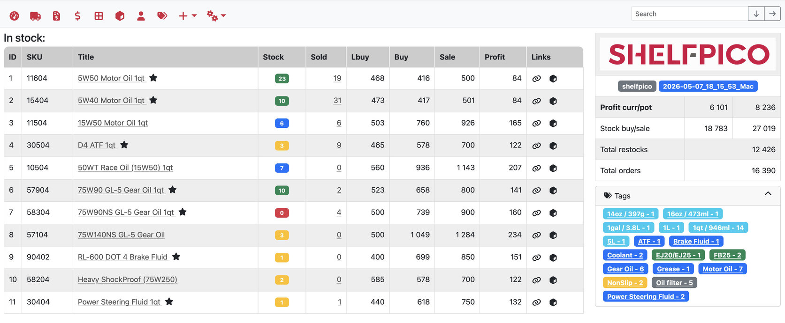

# Shélfpico
Homegrown tiny warehouse engine


## Dashboard page


## Features
* products
* restocks
* orders
* clients
* db backup/restore

## Env
* PHP 8.4
* MySQL 8 / MariaDB 10
* Node 22
* Symfony 7.4
* Vue 3.5
* Webpack 5

## Building assets
```bash
# dev
npm run dev
npm run watch

# prod
npm run prod
```

## Running tests
```bash
codecept run
```

## Clear cache
```bash
php bin/console cache:clear
```

## Check environment variables

### Console command
```bash
# Check dev environment
php bin/console app:env-check

# Check test environment
php bin/console app:env-check --env=test
```

### Web endpoint
```
# Dev environment
http://shelfpico/env-check

# Test environment
http://shelfpico-test/env-check
```

## Virtual hosts
```
<VirtualHost *:80>
    DocumentRoot "/Users/mac/Work/Web/shelfpico/public"
    ServerName shelfpico
    SetEnv APP_ENV dev
    
    <Directory "/Users/mac/Work/Web/shelfpico/public">
	   AllowOverride All
       Require all granted
    </Directory>
</VirtualHost>

<VirtualHost *:80>
    DocumentRoot "/Users/mac/Work/Web/shelfpico/public"
    ServerName shelfpico-test
    SetEnv APP_ENV test
    
    <Directory "/Users/mac/Work/Web/shelfpico/public">
	   AllowOverride All
       Require all granted
    </Directory>
</VirtualHost>
```

## Database management

### Schema creation
```bash
php bin/console doctrine:schema:create --dump-sql
```

### Schema update
```bash
php bin/console doctrine:schema:update --complete --force
# test db
php bin/console doctrine:schema:update --complete --force --env=test
# dry run
php bin/console doctrine:schema:update --dump-sql
php bin/console doctrine:schema:update --dump-sql --env=test
```

### Schema drop
```bash
php bin/console doctrine:schema:drop --force
```

### Schema validation
```bash
php bin/console doctrine:schema:validate
```

### Migrations
Docs are [here](https://www.doctrine-project.org/projects/doctrine-migrations/en/current/reference/introduction.html#introduction)
```bash
php bin/console doctrine:migrations:diff        Generate a migration by comparing your current database to your mapping information.
php bin/console doctrine:migrations:dump-schema Dump the schema for your database to a migration.
php bin/console doctrine:migrations:execute     Execute a single migration version up or down manually.
php bin/console doctrine:migrations:generate    Generate a blank migration class.
php bin/console doctrine:migrations:latest      Outputs the latest version number
php bin/console doctrine:migrations:migrate     Execute a migration to a specified version or the latest available version.
php bin/console doctrine:migrations:rollup      Rollup migrations by deleting all tracked versions and insert the one version that exists.
php bin/console doctrine:migrations:status      View the status of a set of migrations.
php bin/console doctrine:migrations:up-to-date  Tells you if your schema is up-to-date.
php bin/console doctrine:migrations:version     Manually add and delete migration versions from the version table.
php bin/console doctrine:migrations:sync-metadata-storage Sync metadata storage

php bin/console doctrine:migrations:execute --up 20200115215514
php bin/console doctrine:migrations:execute --down 20200115215514
```

### Changing DB schema
```bash
# 1
# change entity mapping
# 2
php bin/console doctrine:migrations:diff
# 3 
php bin/console doctrine:migrations:migrate
# 4
php bin/console doctrine:cache:clear-metadata
# 5
# change entity form class if needed
```

### Export data
```bash
php bin/console app:db-export
php bin/console app:db-export --dry-run
```

### Import data
```bash
php bin/console app:db-import
php bin/console app:db-import --env=test
php bin/console app:db-import --dry-run --env=test
```
